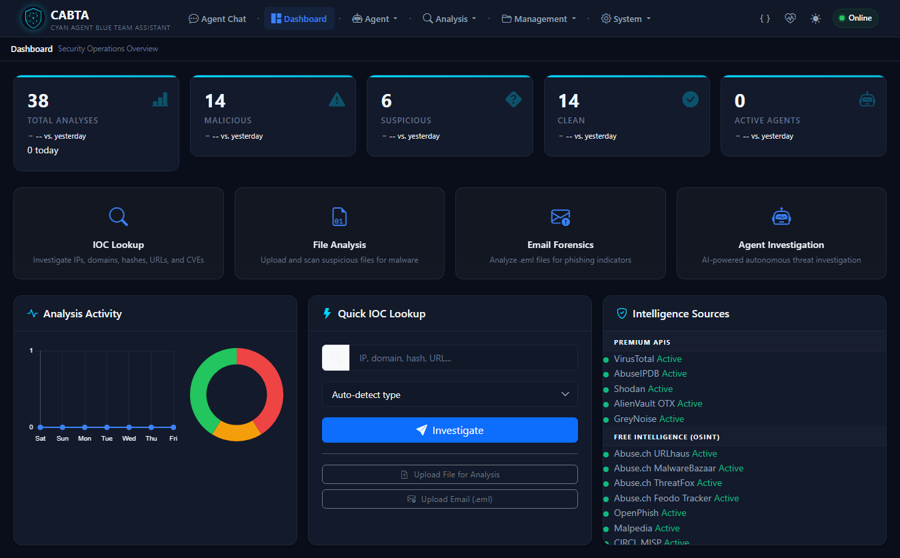
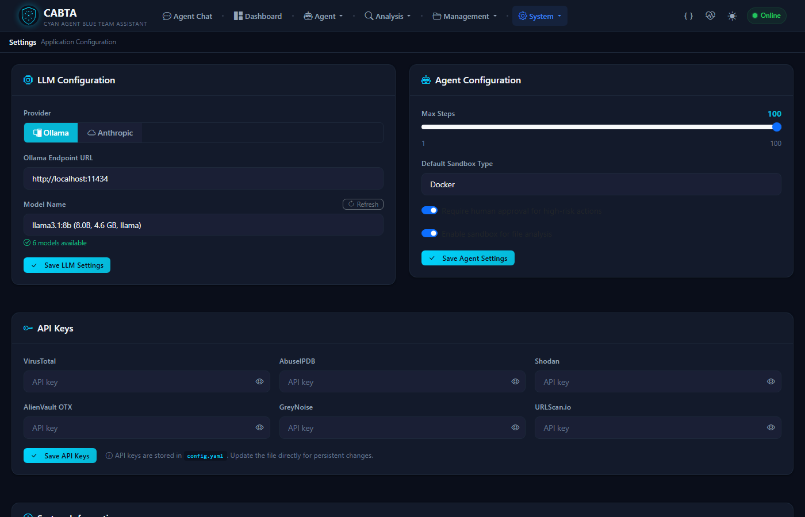
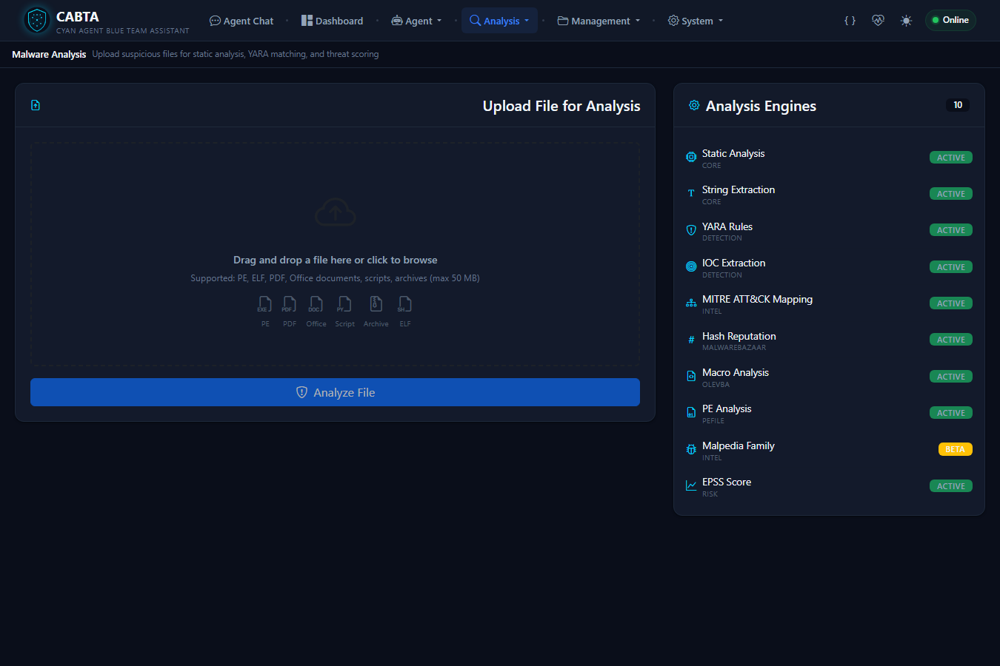
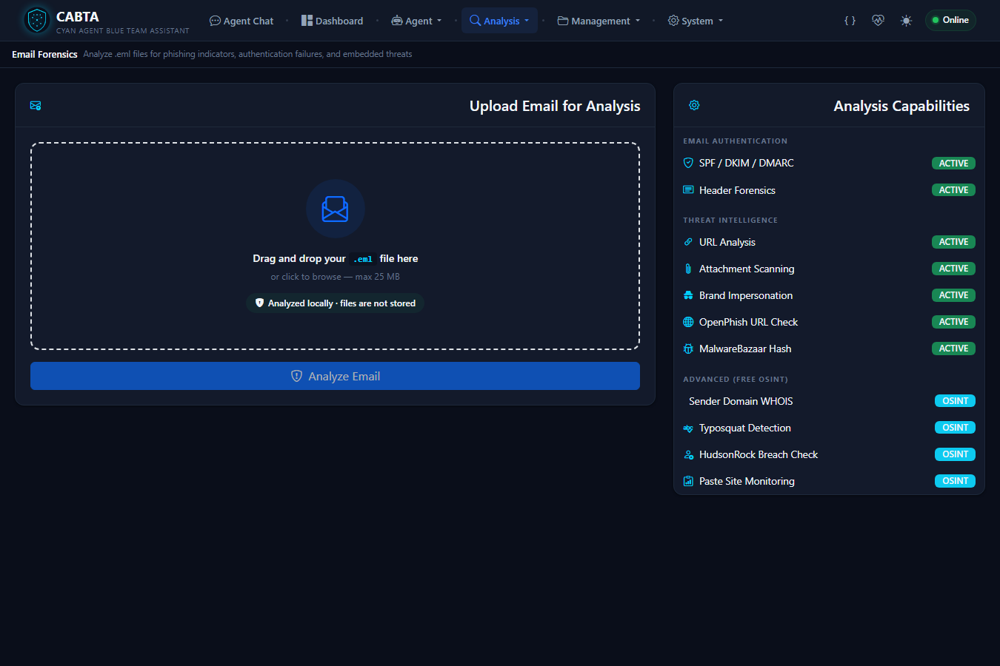

# CABTA — Cyan Agent Blue Team Assistant

AI-powered SOC platform for threat analysis, IOC investigation, email forensics, and playbook-driven response.

[](https://www.python.org/downloads/)
[](LICENSE)
[](https://github.com/kanokrot/cabta-llm)

## 1. Project overview and maturity

CABTA is a local-first platform for SOC analysts, incident responders, and threat hunters. It combines a FastAPI web application, deterministic scoring, file and email analysis, threat-intelligence enrichment, an AI agent, MCP tool servers, and YAML playbooks.

Version **2.0.0** is the product version exposed by FastAPI/OpenAPI and configuration-health endpoints. The project is under active development: core paths have broad automated coverage, while some integrations require external services, credentials, specialist tools, or further production hardening. Local-first does not mean offline-only; operators choose which external integrations to enable.

## 2. Capabilities

- Web-based IOC, file, and email investigations
- Premium and free threat-intelligence enrichment
- PE, ELF, Mach-O, APK, Office, PDF, script, text, archive, firmware, and memory analysis
- Email authentication, phishing, BEC, relay-chain, attachment, and URL analysis
- Deterministic scoring, verdict validation, reports, STIX export, cases, and SQLite ticketing
- Detection-rule generation for KQL, Splunk SPL, Sigma, YARA, Snort, FortiMail, Proofpoint, and Mimecast workflows
- Agent investigations, optional RAG, MCP orchestration, and YAML playbooks
- Human approval gates and secure, read-only remote-host collection
- SMTP email and LINE Messaging API notifications with configurable verdict triggers

### Screenshots

| Dashboard | Settings |
|:--:|:--:|
|  |  |

| File Analysis | Email Forensics |
|:--:|:--:|
|  |  |

## 3. Architecture: Flow A, Flow B, and Flow C

```text
Security input
  ├─ Flow A: direct IOC/file/email analysis
  │    └─ analyzers + integrations → scoring → validated result → report/ticket
  ├─ Flow B: interactive agent investigation
  │    └─ AgentLoop → built-in/MCP tools → observations → final response
  └─ Flow C: YAML playbook execution
       └─ PlaybookEngine → interpolation/conditions/for_each → tools → context
```

**Flow A** accepts API or UI submissions. Specialized analyzers and configured intelligence sources produce evidence; deterministic scoring is authoritative and an LLM may summarize but must not replace the computed verdict.

**Flow B** lets the agent select registered local or MCP tools, record observations, and pause for human approval where required. Sessions and audit information are exposed through the web/API layer.

**Flow C** loads YAML steps, interpolates parameters, evaluates conditions, expands `for_each`, and dispatches local or `mcp:server/tool` calls. MCP calls return `{result, server, tool}`. Template resolution supports both `step.result.data.field` and compatibility paths such as `step.data.field` by traversing verified MCP wrappers automatically. Approval state is preserved when protected execution resumes. Basic Host Forensic Triage uses four single-host, approval-gated remote collection steps.

## 4. Security and data-boundary model

CABTA is a **local-first deployment with optional external intelligence, LLM, sandbox, notification, and remote-host integrations**.

Data may leave the local environment when using:

- threat-intelligence APIs, which receive queried indicators;
- remote vLLM/OpenAI-compatible endpoints, which receive prompt context;
- sandboxes, which may receive samples or metadata;
- SMTP or LINE channels, which receive notification content; or
- SSH collection, which connects to an approved host and returns command output.

Review provider policies and minimize submitted data. Never commit API keys, tokens, passwords, private keys, or populated configuration. SSH collection requires a host-and-username allowlist, a dedicated known-hosts file, and Paramiko `RejectPolicy`; unknown host keys are not accepted automatically. Errors do not expose private-key contents or credential-bearing exception details.

## 5. Quick Start

Requirements: Python 3.10+, plus Ollama or external tools only for features that need them.

```bash
git clone https://github.com/kanokrot/cabta-llm.git
cd cabta-llm
python -m venv .venv
source .venv/bin/activate             # Linux/macOS
# .\.venv\Scripts\Activate.ps1       # Windows PowerShell
pip install -r requirements.txt
cp config.yaml.example config.yaml    # Windows: Copy-Item config.yaml.example config.yaml
python -m uvicorn src.web.app:create_app --factory --host 127.0.0.1 --port 3003
```

Open `http://localhost:3003` or Swagger UI at `http://localhost:3003/api/docs`. Review `config.yaml` first. The example file does not yet document every optional MCP, notification, agent, and remote-host section.

## 6. Configuration

Use placeholders and keep populated configuration out of source control:

```yaml
api_keys:
  virustotal: "<api-key>"
  abuseipdb: "<api-key>"

llm:
  provider: "ollama"
  base_url: "http://localhost:11434"
  model: "<model-name>"

ticketing:
  create_on_verdict: ["MALICIOUS", "SUSPICIOUS"]

notifications:
  enabled: false
  create_on_verdict: ["MALICIOUS", "SUSPICIOUS"]
  email:
    enabled: false
    smtp_host: "<smtp-host>"
    smtp_port: 587
    smtp_user: "<smtp-user>"
    smtp_password: "<smtp-password>"
    from_addr: "<sender>"
    to_addrs: ["<recipient>"]
  line:
    enabled: false
    channel_access_token: "<token>"
    to_user_id: "<user-id>"

remote_hosts: []
```

`NotificationManager` activates configured SMTP email and LINE Messaging API channels for verdicts in `notifications.create_on_verdict`. Notification payloads may contain sensitive findings. MCP servers use `mcp_servers`; supported components may use `BTA_CONFIG` to select an alternate configuration file.

## 7. LLM backends

LLM use is optional; deterministic scoring remains authoritative.

### Ollama (local)

```bash
ollama pull <model-name>
ollama list
```

```yaml
llm:
  provider: "ollama"
  base_url: "http://localhost:11434"
  model: "<model-name>"
```

### vLLM/OpenAI-compatible (remote or self-hosted)

```yaml
llm:
  provider: "vllm"
  vllm_base_url: "https://<approved-host>/v1"
  vllm_model: "<model-name>"
  vllm_api_key: "<api-key-if-required>"
```

Prompt context may be sent to this endpoint. Review its access, retention, and privacy controls.

Optional RAG uses seed data in `data/rag_knowledge/` and defaults to `~/.blue-team-assistant/rag_store`:

```bash
pip install chromadb sentence-transformers
```

## 8. MCP servers: available versus enabled

The repository contains 12 FastMCP modules with 79 decorated tools. Presence does not mean enabled.

### Available in the repository

| Module | Tools | Enabled |
|---|---:|:---:|
| `flare_tools` | 4 | No |
| `forensics_tools` | 8 | Yes |
| `free_osint_tools` | 11 | Yes |
| `ghidra_tools` | 5 | No |
| `malwoverview_tools` | 7 | Yes |
| `mobsf_tools` | 4 | No |
| `network_tools` | 8 | Yes |
| `osint_tools` | 8 | Yes |
| `remnux_tools` | 7 | Yes |
| `remote_tools` | 4 | Yes |
| `threat_intel_tools` | 8 | Yes |
| `vulnerability_tools` | 5 | No |

### Enabled/configured

| Server | Module | Transport | Tools |
|---|---|---|---:|
| `osint_tools` | `src.mcp_servers.osint_tools` | stdio | 8 |
| `free_osint_tools` | `src.mcp_servers.free_osint_tools` | stdio | 11 |
| `network_tools` | `src.mcp_servers.network_tools` | stdio | 8 |
| `malwoverview_tools` | `src.mcp_servers.malwoverview_tools` | stdio | 7 |
| `forensics_tools` | `src.mcp_servers.forensics_tools` | stdio | 8 |
| `remnux_tools` | `src.mcp_servers.remnux_tools` | stdio | 7 |
| `threat_intel_tools` | `src.mcp_servers.threat_intel_tools` | stdio | 8 |
| `remote_tools` | `src.mcp_servers.remote_tools` | stdio | 4 |

Some modules require external binaries, services, or credentials. MCP management and discovery are available under `/api/mcp`.

## 9. Playbooks and approval behavior

| Playbook | Steps | MCP steps | Approval steps |
|---|---:|---:|---:|
| Alert Triage | 21 | 17 | 0 |
| Email Investigation | 35 | 30 | 0 |
| Exploit Reversing | 46 | 43 | 0 |
| Basic Host Forensic Triage | 15 | 11 | 4 |
| Incident Response | 38 | 29 | 3 |
| IOC Triage | 20 | 15 | 0 |
| Unified Malware Analysis | 60 | 48 | 1 |
| Malware Deep Dive | 45 | 42 | 0 |
| Phishing Investigation | 21 | 16 | 0 |

`requires_approval: true` pauses before a protected operation; approval or rejection is available through playbook/agent session APIs. A playbook with zero approval steps is not necessarily safe for unattended production use. Playbooks support templates, conditions, and `for_each`; review every tool before automation.

## 10. Remote Host Collection

`remote_tools` performs read-only Linux collection over SSH and is wired into four approval-gated Basic Host Forensic Triage steps.

```yaml
remote_hosts:
  - name: "<reference-name>"
    host: "<hostname-or-ip>"
    port: 22
    username: "<ssh-account>"
    key_path: "<private-key-path>"
    known_hosts_path: "<dedicated-known-hosts-path>"
    description: "<optional-description>"
```

The connection must match `host` and `username`, and the caller-supplied `key_path` must match the private-key path pinned in that allowlist entry. Entries without `key_path` are rejected. The allowlist also supplies the pinned known-hosts file. With `remote_hosts: []`, every remote call is rejected and real collection is unavailable until approved infrastructure is provisioned.

| Tool | Command(s) | Result |
|---|---|---|
| `system_info_collect` | `uname -a`, `hostname`, `uptime` | System identity and uptime |
| `process_list_collect` | `ps aux` | Raw process snapshot |
| `netstat_collect` | `ss -tanp` | Raw TCP states plus unique validated peer IPs from `ESTAB` rows |
| `event_log_collect` | `journalctl --since ... --no-pager` | Raw journal text for a named time range |

Raw network output retains LISTEN and other states; `remote_ips` contains only non-loopback, non-unspecified ESTAB peers. Empty or malformed output yields `[]`. Stable `{status, error, data}` errors cover allowlist, key, known-host, authentication, timeout, and SSH failures without returning credentials.

## 11. Analysis modules

**File and malware:** PE deep inspection, ransomware and packer indicators, Cobalt Strike extraction, ELF, Mach-O, APK, Office, PDF, scripts, text, archives, firmware, and memory.

**Email:** SPF/DKIM/DMARC/ARC assessment, BEC and impersonation detection, relay analysis, URLs, attachments, tracking pixels, forms, shorteners, and callback phishing.

**IOC:** IPv4/IPv6, domains, URLs, hashes, email, and CVEs with configured reputation, DGA, domain-age, ASN/geolocation, and threat-actor context.

**Scoring and reporting:** tool-based, source-aware, adaptive, enhanced, and false-positive-filter layers; JSON, HTML, PDF, SOC output, MITRE Navigator, STIX, and detection rules. Common verdicts include `MALICIOUS`, `SUSPICIOUS`, `CLEAN`, and `UNKNOWN`.

## 12. API and Web UI

Use `/api/docs` as the generated, authoritative API reference.

| Prefix | Purpose |
|---|---|
| `/api/analysis` | IOC, file, and email analysis |
| `/api/reports` | JSON, HTML, HTML download, MITRE, and PDF reports |
| `/api/dashboard` | Statistics and activity |
| `/api/config` | Health, version/info, settings, and tool/system status |
| `/api/cases` | Cases, status, analyses, and notes |
| `/api/agent` | Investigations, sessions, approvals, cancellation, and audit |
| `/api/chat` | Interactive chat sessions |
| `/api/playbooks` | Listing, execution, approval, and reports |
| `/api/mcp` | Server management, checks, and tool discovery |
| `/api/tickets` | Incident tickets |

The UI includes dashboards, SOC operations, analysis forms, history, cases, tickets, reports, agent pages, playbooks, MCP management, and settings.

## 13. Testing

```bash
python -m pytest
python -m pytest tests/test_remote_tools.py -v
```

Last verified **2026-09-02**:

```text
921 passed, 3 known failures
```

The known failures were the unsuffixed `for_each` result reference, URLhaus direct call, and URLhaus through MCP. This is a dated observation, not a permanent expectation; re-run tests in the current environment and distinguish network-dependent failures from unit regressions.

## 14. Known limitations

- Web/OpenAPI exposes product version 2.0.0, while stale 1.0.0 metadata remains in separate source, MCP identity, and report-footer locations.
- `config.yaml.example` does not yet cover every optional runtime section documented here.
- Remote collection is Linux-specific and unusable while `remote_hosts` is empty.
- `ss` parsing assumes standard iproute2 columns and enriches only ESTAB peers; TIME-WAIT/CLOSE-WAIT remain only in raw output.
- Event-log time ranges use a small named mapping and otherwise default to 24 hours.
- Some MCP modules require unconfigured external tools or services.
- The unsuffixed `for_each` aggregate-reference bug remains separate from MCP wrapper resolution.
- External integration tests depend on credentials, provider availability, and network access.
- Real SSH end-to-end validation requires separately approved hosts, keys, and known-hosts files.

## 15. Project structure

```text
CABTA/
├─ src/
│  ├─ agent/          # Agent, MCP client, sessions, RAG, playbook engine
│  ├─ analyzers/      # File, email, malware, and memory analysis
│  ├─ integrations/   # TI, LLM, sandbox, notifications, tickets, STIX
│  ├─ mcp_servers/    # 12 FastMCP modules
│  ├─ reporting/      # JSON/HTML/PDF/SOC reports
│  ├─ scoring/        # Deterministic scoring
│  └─ web/            # FastAPI application and routes
├─ data/
│  ├─ playbooks/      # 9 YAML playbooks
│  └─ rag_knowledge/  # RAG seeds
├─ docs/              # Documentation and screenshots
├─ examples/          # Synthetic/sample inputs
├─ static/            # Web assets
├─ templates/         # Web templates
├─ tests/             # Automated tests
├─ config.yaml.example
└─ requirements.txt
```

## 16. Contributing, license, and disclaimer

### Contributing

Fork the repository, create a focused branch, add tests for behavioral changes, run targeted and full suites, document security/configuration effects, and open a pull request with verification results. Never commit populated configurations, tokens, passwords, API/private keys, known-host material, or sensitive samples.

### License

Licensed under the MIT License; see [LICENSE](LICENSE).

### Author

**Original Author: Ugur Ates**

- GitHub: [@ugurrates](https://github.com/ugurrates)
- Medium: [@ugur.can.ates](https://medium.com/@ugur.can.ates)
- LinkedIn: [Ugur Ates](https://www.linkedin.com/in/ugurcanates/)

This fork ([kanokrot/cabta-llm](https://github.com/kanokrot/cabta-llm)) is maintained by [@kanokrot](https://github.com/kanokrot), building on the original CABTA project.

### Acknowledgments

- [MITRE ATT&CK](https://attack.mitre.org/) for the threat framework
- [VirusTotal](https://www.virustotal.com/) for threat intelligence
- [Ollama](https://ollama.com/) for local LLM support
- [Mandiant FLARE](https://github.com/mandiant) for capa and FLOSS
- [Abuse.ch](https://abuse.ch/) for free threat-intelligence feeds

### Disclaimer

CABTA is intended for authorized security testing, investigation, and research. Users are responsible for authorization, data and credential protection, reviewing automated findings, and legal/provider compliance. The authors and maintainers are not responsible for misuse.
